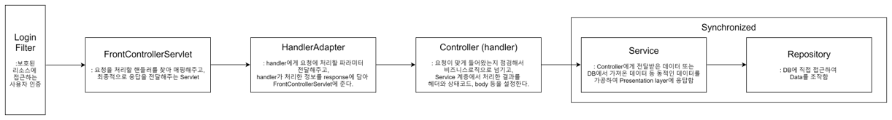

## 구성

## 목표
Facebook Feed처럼 글을 올리고, 그 글에 댓글과 좋아요를 눌러 사용자간 소통이 가능한 소셜피드 서비스 구현

## 기능
- [User] 로그인, 회원가입 API
- [User] 사용자 인증 API
    - 사용자권한
        - 모든 사용자: 글, 댓글, 좋아요 읽기, 로그인, 회원가입
        - 가입한 사용자: 글 쓰기/수정/삭제, 댓글 쓰기/수정/삭제, 좋아요 하기/취소
- [Feed] 글 CRUD API
- [Feed] 댓글 CRUD API
- [Feed] 좋아요 CRUD API

## API 문서
[Postman을 이용한 API문서](https://documenter.getpostman.com/view/8568933/TzedhQh6)

## DB
### 설계

### In-Memory
#### User (사용자)

#### Post (게시물)

#### Comment (댓글)

#### Like (좋아요)

## 프로젝트 구조
├── README.md  
├── src  
│   ├── main  
│   │   ├── java.com.moneelab.assignment  
│   │   │   ├── domain  
│   │   │   ├── dto  
│   │   │   ├── repository  
│   │   │   ├── util  
│   │   │   └── web  
│   │   │   │   ├── adapter  
│   │   │   │   ├── controller  
│   ├── resources  
│   └── webapp  
│   ├── test  
│   │   ├── java.com.moneelab.assignment  
│   │   └── resources  
├── build.gradle  
├── gradlew  
├── gradlew.bat  
└── .gitignore  

## 프로젝트 흐름

## 문제해결 전략

## 실행방법
### Tomcat 설정 및 빌드

### Postman 실행

### Test 실행

